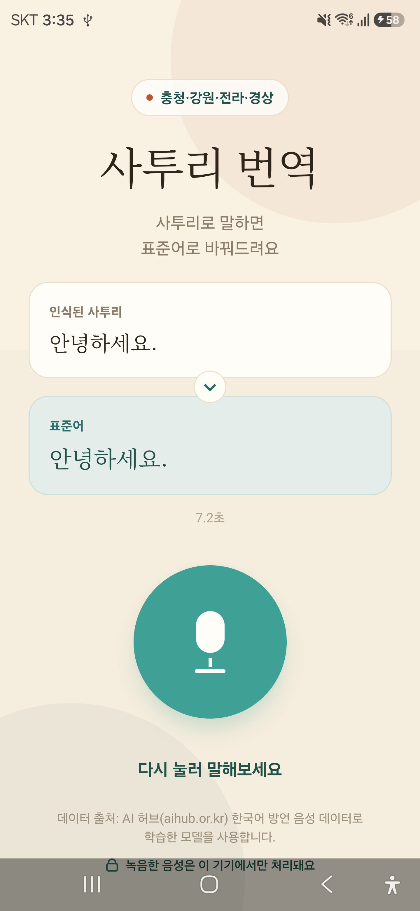
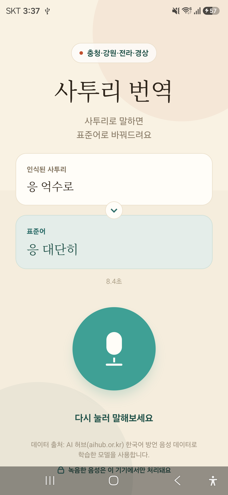

# 알아 묵나? — 사투리 → 표준어 음성 번역 (온디바이스)

충청·강원·전라·경상 **사투리 음성**을 녹음하면 **표준어 텍스트로 바꿔주는** 안드로이드 앱. 음성 인식과 번역을 **서버 없이 휴대폰 안에서(온디바이스)** 처리한다. 표준 음성/언어 모델이 약한 **사투리 영역을 AI Hub 방언 데이터로 파인튜닝해 개선**하고, 그 모델을 양자화해 오프라인으로 동작시키는 것이 핵심이다.


## 데모 (실기기 · Galaxy S24)

<p align="center"></p>

<p align="center"><em>"이거 억수로 맛있다" → "이거 대단히 맛있다" · 서버 없이 기기 안에서 (GIF는 소리 없음)</em></p>

| 표준어 입력은 그대로 | 사투리는 표준어로 변환 |
|---|---|
|  |  |
| "안녕하세요" → "안녕하세요" | "응 억수로" → "응 **대단히**" |

신규 설치 → 첫 실행 시 모델(~490MB) 다운로드 → 이후 **완전 오프라인**으로 녹음·인식·번역. 실기기 처리 **7~8초**(arm).

## 핵심 성과

- **데이터로 두 단계 모두 개선** — 표준 모델이 못하는 사투리를 파인튜닝으로 정량 개선
  - STT(Whisper) 사투리 인식 CER **20.3% → 11.7%** (4지역 LoRA, held-out val)
  - 변환(KoBART) copy 기준 대비 CER **5.79% → 1.63%** (4지역), 정확일치 26.5% → 77.7%
  - End-to-End(음성→표준어) 조용한 환경 CER **~8.5%**
- **온디바이스** — 서버 비용 0, 오프라인 동작, 음성이 기기를 벗어나지 않음(프라이버시)
- **양자화로 무손실 경량화** — 총 **1.2GB → 490MB**(−60%)인데 CER 저하 없음
  - STT q5_0: 487→175MB, 동일 val 120파일 f16 대비 **−0.35%p(오히려 우세)**
  - 변환기 int8(ExecuTorch): 587→314MB, PyTorch 대비 생성 정합성 5/5 일치

정량 지표·표는 [EVALUATION.md](EVALUATION.md), 설계·의사결정 기록은 [DEVELOPMENT_JOURNEY.md](DEVELOPMENT_JOURNEY.md).

## 파이프라인 (전부 온디바이스)

```
음성 ──[① STT: Whisper q5]──▶ 사투리 텍스트 ──[② 변환: KoBART int8]──▶ 표준어 텍스트
       (사투리 음성 인식)                        (사투리→표준어 재작성)
```

- **① STT** — Whisper-small을 4지역 방언 음성으로 **LoRA 파인튜닝** → GGUF **q5_0** 양자화 → [whisper.rn](https://github.com/mybigday/whisper.rn)(whisper.cpp)로 기기에서 실행.
- **② 변환** — `gogamza/kobart-base-v2`를 사투리→표준어 문장쌍으로 파인튜닝 → ExecuTorch **.pte(int8 weight-only)** export → [react-native-executorch](https://github.com/software-mansion/react-native-executorch)로 encoder 1회 + decoder greedy 루프 실행. 토크나이저·생성 루프를 앱에서 직접 구현.
- 녹음은 `@siteed/expo-audio-studio`로 16kHz mono PCM WAV. 결과는 화면에만 표시.

통합 과정의 핵심 난관 해결(onnxruntime 실패→ExecuTorch 전환, 빈출력 버그, int8 임베딩 함정 등)은 [docs/ondevice-plan.md](docs/ondevice-plan.md).

## 핵심 접근 — 데이터로 개선

AI Hub 방언 라벨을 전처리해 **208만 문장쌍**을 확보했고, 이 중 실제 방언 변형(사투리≠표준)은 **33.6만(16.1%)**. 가장 흔한 치환은 `쫌`→`조금`, `이케`→`이렇게`, `그니까`→`그러니까`, `니`→`너`, `걍`→`그냥` … 규칙 사전으로 다 담기 어려운 이 다양성을 **모델이 데이터로 학습**한다.

| 단계 | 기준선(copy/표준) | 파인튜닝 후 |
|---|---|---|
| STT (4지역, CER) | 20.3% | **11.7%** |
| 변환 (4지역, CER) | 5.79% | **1.63%** |
| 변환 (4지역, 정확일치) | 26.5% | **77.7%** |

전체 분석 [data/analysis.md](data/analysis.md), 파인튜닝 근거 [why_finetune.md](why_finetune.md).

## 기술 스택

- **앱/런타임**: React Native (Expo SDK 57, New Architecture), whisper.rn(GGUF), react-native-executorch(ExecuTorch), @siteed/expo-audio-studio, 첫 실행 모델 다운로드(GitHub Releases 호스팅)
- **학습**: HuggingFace `transformers` + `peft`(LoRA), Colab GPU
- **양자화/변환**: whisper.cpp(q5 GGUF), ExecuTorch export(torchao int8 weight-only)
- **개발용 백엔드**: FastAPI — 학습 중 서빙·평가에 사용(런타임 서버 아님)
- **데이터**: AI Hub 「한국어 방언 발화」(충청·강원·전라·경상)

## 데이터 출처 및 이용 고지

- 학습 데이터 출처는 **AI 허브(aihub.or.kr)** 「한국어 방언 발화」 데이터셋이다.
- 공개·배포 대상은 **파인튜닝 결과물(모델)** 이며, **원본 음성·전사 및 이를 가공·추출한 자료는 저장소·앱에 포함하지 않고 재배포하지 않는다**(AI 허브 이용정책 준수). 해당 산출물은 `.gitignore`로 제외.
- 앱 화면·개인정보처리방침에 출처를 명시한다.

## 저장소 구조

```
mobile/      React Native(Expo) 온디바이스 앱 (STT+변환, 첫 실행 모델 다운로드)
backend/     모델 export·양자화·평가 스크립트 (개발용)
training/    STT/변환 파인튜닝·평가 스크립트
data/        AI Hub 전처리·분석 (원본 미포함)
docs/        평가·개발기록·출시 체크리스트·개인정보방침·스토어 자산
```

## 실행 (개발)

```bash
cd mobile
npm install
npx expo run:android      # 개발 빌드. 첫 실행 시 모델(~490MB) 다운로드 후 오프라인 동작
```

> 릴리스 빌드/서명·플레이스토어 준비는 [docs/release-checklist.md](docs/release-checklist.md) 참고.
> 데이터 전처리·파인튜닝 재현은 [data/](data/), [training/](training/), [notebooks/](notebooks/).

## 현재 상태

- [x] AI Hub 전처리 + 208만 문장쌍 + 데이터 분석
- [x] 변환(KoBART) 4지역 파인튜닝 — copy 대비 **CER 5.8%→1.6%**
- [x] STT(Whisper) 4지역 LoRA + 소음 증강 — 표준 대비 **CER 20.3%→11.7%**
- [x] End-to-End 평가 — 음성→표준어 CER **~8.5%**(조용), 상세 [EVALUATION.md](EVALUATION.md)
- [x] **온디바이스 통합** — whisper.rn + ExecuTorch, 실기기 E2E 동작(7~8초)
- [x] **양자화** — 1.2GB→490MB, CER 저하 없음(정량 검증)
- [x] **아이덴티티·배포 준비** — 앱 이름·아이콘, 개인정보방침 호스팅, 스토어 자산, 서명 AAB
- [ ] 플레이스토어 비공개 테스트 → 출시

진행 상세 [DEVELOPMENT_JOURNEY.md](DEVELOPMENT_JOURNEY.md).
